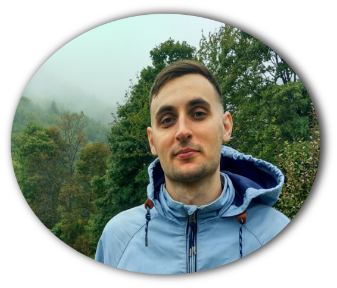

***
## About me

## 
Hi everyone! My name is Ivan. I am currently looking for a job as a QA Engineer. I live in Shymkent, Kazakhstan. Ready to consider vacancies around the world. Relocation is possible (full-time, remote, hybrid). 

## Сontacts
| | | |
|:-:|:-:|:-:|
| +7 (707) 777-00-77| kashubaim@gmail.com| [160023, Shymkent, Kazakhstan](https://www.google.com/maps/place/%D0%A8%D1%8B%D0%BC%D0%BA%D0%B5%D0%BD%D1%82/@42.3418204,69.5898056,12z/data=!3m1!4b1!4m6!3m5!1s0x38a8f256546681bb:0xa167b582e75b369b!8m2!3d42.3416847!4d69.590101!16zL20vMDc1ZGg5?entry=ttu)|
|+7 (931) 001-55-39|[Kashuba Ivan](https://www.linkedin.com/in/kashubaim/)| |
 

## Education
2008 - 2013 St. Petersburg State Transport University. Specialist automated information systems security  

## Work Experience
|Date | Speciality| Description|
|---:|:---:|:-------:|
|2014-2022|Certification department specialist|Сreated a system for protecting autonomous objects (premises, networks, printing systems). Developed programs and methods for testing an automated system. Tested the compliance of objects with the requirements of the documentation. Prepared test report. Developed information security documentation. Reviewed company documentation.|
|2012-2013|Cyber Security Engineer|Generated digital signatures and issuing certificates. Provided technical customer support for working with digital signatures (installation, configuration of software for working with digital signatures, etc.). Prepared and handled documents.|
 
***
